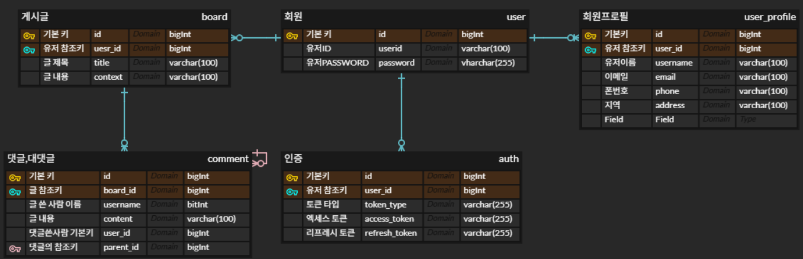

# 프로젝트 개요


---

## 📅 1일차  
**Docker 기반 Spring 다중 서버 + Nginx 로드 밸런싱 환경 구축**

### ✅ 주요 작업

- `backend1`, `backend2`, `backend3`: 동일한 Spring 애플리케이션 컨테이너 3개 생성
- 각 컨테이너에 `PROJECT_NAME` 환경변수로 서버 식별 값 주입
- `nginx.conf`를 통해 **라운드로빈 방식**으로 요청 분산 처리
- Nginx 컨테이너에서 3개 백엔드 컨테이너를 `upstream`으로 연결
- MySQL 컨테이너 구성 및 `volume` 설정 완료 (`/volumes/mysql-data`)
- Spring 컨트롤러에서 `/api` 엔드포인트로 응답값 출력
- `docker-compose.yml`을 사용해 전체 구성 자동화

### 🔍 결과 확인

- 브라우저에서 `http://localhost` 접속 시 backend 서버가 순차적으로 응답하는 구조 확인 완료

---

## 📅 2일차  
**STOMP 기반 WebSocket 채팅 서버 및 Nginx WebSocket 프록시 구성**

### ✅ 주요 작업

- Spring WebSocket + STOMP 설정 완료 (`/ws-chat` 엔드포인트 사용)
- 프론트엔드에서 `nickname` 파라미터 기반 WebSocket 연결 구현 (`/ws-chat?nickname=xxx`)
- `@MessageMapping`, `@SendTo` 로직으로 STOMP 메시지 처리 구성
- Nginx에서 `/ws-chat` 요청을 **WebSocket 업그레이드**와 함께 백엔드로 프록시 처리
- `nginx.conf`에 `proxy_set_header` 및 `Upgrade` 헤더 설정으로 WebSocket 연결 유지
- backend1 ~ backend3 컨테이너에 동일한 WebSocket 서버 적용
- MySQL과 연결되는 Spring backend 컨테이너 정상 기동 확인
- Redis Pub/Sub 없이도 WebSocket 연결 및 메시지 송수신 확인

### 🔍 결과 확인

- 브라우저에서 `http://localhost` 접속 후 WebSocket 연결 및 채팅 메시지 송수신 정상 작동

---

## 📅 3일차
**Redis Pub/Sub 기반 WebSocket 채팅 메시지 분산 처리 구현**

### ✅ 주요 작업

- Redis 컨테이너 추가 및 `StringRedisTemplate` 기반 Pub/Sub 구조 도입
- 각 Spring 서버가 Redis를 통해 채팅 메시지를 publish → subscribe 하도록 구성
- `RedisPublisher` 클래스: 채팅 메시지를 Redis 채널(`room.*`)로 발행
- `RedisSubscriber` 클래스: Redis로부터 메시지를 수신해 WebSocket 구독자에게 전달
- `RedisMessageListenerContainer` 설정으로 `room.*`, `user.*` 채널 패턴 구독 처리
- 서버 간 메시지 일관성을 위해 단일 서버가 아닌 모든 서버가 동일한 메시지를 수신하도록 설계
- 귓속말 기능을 위해 `/user/queue/private` 경로 활용 (WebSocket STOMP)

### 🔍 결과 확인

- `backend1`, `backend2`, `backend3` 중 어떤 서버로 접속해도 채팅방 메시지가 모든 서버에 동기화됨
- Redis가 메시지를 중계하여 **멀티 서버 환경에서 실시간 채팅 일관성 보장**
- 클라이언트 간 귓속말 메시지 또한 정상 수신됨 (`/user/queue/private`)

---

## 📅 4일차
**AI 자동응답 기능 연동 및 WebSocket 프록시 문제 해결**

### ✅ 주요 작업

- `GPTService.java`를 통해 **OpenAI GPT-4.1 API** 연동 구현
    - 클라이언트 메시지를 OpenAI API로 전송하고 응답을 다시 채팅방에 전송
- Spring STOMP 채팅 흐름에 **AI 챗봇 자동응답 기능 추가**
    - 메시지를 수신하면 GPT 응답을 자동으로 브로드캐스트
- `HttpClient`를 사용해 OpenAI API 호출 및 JSON 응답 파싱 로직 작성

### 🔐 보안 및 GitHub Push Protection 대응

- 실수로 커밋된 **API Key 노출 문제 해결**
    - GitHub Push Protection으로 인한 `GH013` 에러 발생
    - 해당 API Key가 포함된 파일을 **삭제하고 커밋 내역을 정리**한 뒤 `--force push`로 재업로드

### 🛠️ WebSocket 연결 문제 해결

- Nginx에서 **WebSocket 연결 실패 및 프록시 문제** 디버깅
    - `proxy_pass`, `Upgrade`, `Connection` 등 헤더를 재설정하여 WebSocket 정상 연결
    - `/ws-chat` 경로의 WebSocket 요청이 백엔드로 올바르게 전달되도록 `nginx.conf` 수정
- 브라우저 콘솔(F12) 및 `docker logs` 명령어를 통한 실시간 로그 확인

### 🔍 결과 확인

- 클라이언트가 일반 채팅 메시지를 보내면, GPT-4.1 응답이 자동으로 수신되어 실시간 전송됨
- 브라우저에서 WebSocket 연결 및 AI 응답 동작 모두 정상 작동
- 민감 정보가 GitHub에 포함되지 않도록 **토큰을 제거한 커밋으로 정리 완료**

---
## 📅 5일차 시작 전 Docker Compose 구조 분리
# Docker Compose 구조 분리 전/후 비교

이 프로젝트는 `docker-compose` 구성 파일을 **단일 파일 방식**에서  
**`data`(데이터 계층)와 `backend`(애플리케이션 계층)**으로 분리하여  
보다 유연하고 유지보수하기 쉬운 구조로 개선

---

## 🔁 분리 전: 단일 Compose 파일

- 모든 서비스(MySQL, Redis, 백엔드, Nginx)가 **한 파일에 정의됨**
- 실행, 중지, 재시작을 **모두 함께 수행해야 함**
- 백엔드 코드를 수정해도 **DB까지 영향을 받음**
- **테스트나 배포 유연성이 낮음**


## 🔀 분리 후: `data` / `backend`로 구분

### 📁 `data/docker-compose.data.yml`
- MySQL, Redis 등 **데이터 서비스만 정의**
- 외부 네트워크(`prod_server`)를 통해 백엔드와 통신

### 📁 `backend/docker-compose.yml`
- Spring 백엔드 서버 3개 + Nginx 로드밸런서 정의
- DB와 Redis는 **연결만 하고 직접 실행하지 않음**


## ✅ 구조 분리의 장점

| 구분 | 장점 |
|------|------|
| **독립 실행** | DB와 Redis를 **따로 실행/종료/유지보수**할 수 있음 |
| **빠른 빌드** | 백엔드만 변경 시, **데이터 서비스 재시작 없이 빠른 빌드 가능** |
| **재사용성** | `data` 구성은 다른 프로젝트에서도 **재사용 가능** |
| **배포 유연성** | 운영 환경에서 **외부 DB/Redis 연결**에도 쉽게 대응 가능 |
| **장애 격리** | 데이터 서비스 장애가 있어도 백엔드를 **따로 유지 가능** |
| **로컬 테스트 최적화** | `backend`만 여러 번 재기동하며 개발/테스트하기 쉬움 |


## 📌 외부 네트워크 사용

모든 서비스는 `prod_server`라는 공통 Docker 네트워크에 연결되어 있으며,  
이를 통해 서로 다른 디렉토리의 Compose 파일에서도 **컨테이너 간 통신이 가능**

```bash
docker network create prod_server
```

---

## 📅 5일차
**Spring Data JPA 기반 회원가입/로그인 기능 구현 및 ERD 정리**

### ✅ 주요 작업

- Spring Data JPA를 기반으로 **회원가입 → 로그인 흐름** 구현
- 회원가입 시 입력한 정보는 `user`, `user_profile` 테이블에 저장
- 로그인 시 입력한 `userid`, `password`가 DB 정보와 일치하는지 검증
- 로그인 성공 시 **세션 기반 인증 처리** (`HttpSession` 사용)
- 로그인/회원가입 페이지 HTML 폼 작성 및 연동 완료

### 🧩 ERD 설계 반영

- 사용자(`user`)와 사용자 프로필(`user_profile`) 분리 설계
- 게시글(`board`), 댓글(`comment`), 인증(`auth`)까지 포함한 전체 구조 기반으로 기능 설계

### 🗂️ ERD 이미지



### 🔍 결과 확인

- 브라우저에서 회원가입 → 로그인 → 세션 생성까지 흐름 정상 작동
- 로그인 성공 후 세션을 통해 인증 상태 유지 가능

---

## 📅 6일차
**게시판 기능 구현 (CRUD, 검색, 페이징) 및 대용량 배치 저장 처리**

### ✅ 주요 작업

- `Board` 엔티티 기반으로 **게시판 CRUD 기능** 구현
  - **글쓰기**: `/boards`에 `POST` 요청으로 게시글 등록  
    → `user_id`를 통해 작성자 `User`와 연관관계 설정
  - **게시글 상세 조회**: `/boards/{id}` `GET` 요청
  - **게시글 수정**: `/boards/{id}` `PUT` 요청
  - **게시글 삭제**: `/boards/{id}` `DELETE` 요청
- `Board`는 `User`와 다대일(`@ManyToOne`) 관계이며, 댓글(Comment)과는 일대다(`@OneToMany`)로 매핑됨
- 모든 작업은 `BoardDTO`를 통해 클라이언트와 데이터 송수신 처리


### 🔍 검색 및 페이징 기능

- **페이징된 전체 조회**:  
  `/boards?page={번호}&size={개수}`로 요청 시 `Page<BoardDTO>` 응답  
  → `findAllPaging(Pageable)` JPQL 사용
- **키워드 검색**:  
  `/boards/search?keyword={text}`로 제목 또는 내용에서 키워드 포함된 게시글 검색  
  → `searchKeywordPaging(String, Pageable)` JPQL 사용  
  → 대소문자 구분 없이 `LIKE` 검색 수행
- **검색 + 페이징 동시 지원**


### 🧱 대용량 게시글 배치 저장

- `BoardController`의 `/boards/batchInsert` API를 통해 `List<BoardDTO>` 단위로 MySQL에 배치 저장
  - 내부적으로 `JdbcTemplate.batchUpdate()` 사용
  - SQL 문: `INSERT INTO board (title, content, user_id, created_date, updated_date, batchkey) VALUES (?, ?, ?, ?, ?, ?)`
  - 1000개 단위로 자른 후 반복 저장하며 `batchkey(UUID)`를 지정해 동일 배치 내 데이터 식별
- `/boards/jpaBatchInsert` API는 `List<Board>`를 `EntityManager.persist()` 방식으로 저장
  - 1000개마다 `flush()` 및 `clear()` 호출하여 메모리 사용량 제어


### 🔍 결과 확인

- CRUD, 검색, 페이징 기능이 모두 정상 동작함
- 수천 개의 게시글도 `/batchInsert`, `/jpaBatchInsert` API를 통해 안정적으로 저장됨
- `username`, `user_id`, `created_date`, `updated_date` 정보가 `BoardDTO`에 포함되어 응답으로 제공됨

---

## 📅 7일차
**Spring Security + JWT 기반 인증 시스템 적용 및 게시판 권한 연동**

### ✅ 주요 작업

- 기존 단순 로그인 방식을 **Spring Security 기반 구조로 전환**
- 로그인 시 **Access Token / Refresh Token** 발급 및 DB(`auth` 테이블)에 저장
  - Access Token: 짧은 유효시간의 인증 토큰
  - Refresh Token: 재발급을 위한 장기 토큰 (쿠키 or Authorization 헤더에서 수신)
- JWT 토큰은 `JwtTokenProvider`에서 생성/검증하며, `JwtTokenFilter`에서 요청마다 인증 수행

### 🔐 인증 처리 흐름

- 사용자는 `/api/auth/loginSecurity`로 로그인 요청  
  → 유효한 경우 JWT 토큰 발급 및 응답
- 이후 클라이언트는 요청 시 `Authorization: Bearer <access_token>` 헤더 포함
- 백엔드는 `JwtTokenFilter`를 통해 토큰을 검증하고 `SecurityContext`에 사용자 정보 저장

### 🧩 게시판 기능에 JWT 인증 연동

- 게시글 작성 시 `@AuthenticationPrincipal`을 통해 현재 로그인한 사용자 정보를 획득  
  → 해당 사용자의 `user_id`를 자동으로 게시글에 연관 설정
- 토큰 없이 게시글 작성 시 `403 Forbidden` 응답

### 🔄 토큰 갱신 기능 추가

- `/api/auth/refresh` 엔드포인트로 Refresh Token 전달 시, 새 Access Token 발급
- Refresh Token은 쿠키 또는 `Authorization` 헤더에서 자동 추출됨
- 유효성 검사 후 새로운 토큰으로 갱신 및 `auth` 테이블 업데이트

---

### 🔍 결과 확인

- JWT 기반 로그인/인증 흐름이 정상 작동하며, 모든 요청에서 `SecurityContext`를 통해 사용자 정보 활용 가능
- 게시판 글 작성 시 현재 로그인한 사용자의 ID가 자동 연결됨
- 로그인 후 토큰 없이 요청 시 접근 차단(403) 확인 완료
- Refresh Token을 통한 Access Token 갱신 기능 정상 작동

---

## 📅 8일차
**ElasticSearch + Logstash + Kibana 구축**

### ✅ 주요 작업

- `prod_server` 네트워크 기반으로 **ElasticSearch, Logstash, Kibana 컨테이너 구축 및 연동**
- `backend1 ~ backend3` 애플리케이션 로그를 Logstash → ElasticSearch로 전달 후 Kibana 시각화
- `logback-spring.xml`을 사용해 **ELK 연동용 파일 로그 출력 구조 적용**


### 🛠️ 로그 수집 및 전달 구조

- **로그 경로**: `logs/app.log`
- **출력 패턴**: `%d{yyyy-MM-dd HH:mm:ss.SSS} [%thread] [%-3level] %logger{5} - %msg%n`
- **RollingFileAppender** 사용:
  - 일자별 파일 자동 분리(`app-YYYY-MM-DD.log`)
  - **10일치까지만 보관 후 자동 삭제**
- 콘솔 비동기(ASYNC) + 파일 로그 동시 출력, `root level="INFO"` 설정


### 🛠️ Logstash 설정

- **input**: `/logs/app.log`, `start_position => "beginning"`, `sincedb_path => "/dev/null"`
- **filter**:
  - `grok`으로 `timestamp`, `thread`, `level`, `logger`, `log` 추출
  - `AOP_LOG` → `log_type: aop`, `OAuth2_LOG` → `log_type: OAuth2`
  - `date` 필터로 `@timestamp` 변환, `Asia/Seoul` 타임존 적용
- **output**:
  - ElasticSearch(`http://elasticsearch:9200`), 인덱스: `spring-logs-%{+YYYY.MM.dd}`
  - `stdout { codec => rubydebug }` (디버깅용)


### 🛠️ Docker Compose 기반 ELK 구성

- **ElasticSearch**
  - 이미지: `docker.elastic.co/elasticsearch/elasticsearch:8.12.0`
  - 포트: `9200`, `9300`
  - 환경: `xpack.security.enabled=false`
  - 볼륨: `./volumes/esdata:/usr/share/elasticsearch/data`

- **Kibana**
  - 이미지: `docker.elastic.co/kibana/kibana:8.12.0`
  - 포트: `5601`
  - 환경: `ELASTICSEARCH_HOSTS=http://elasticsearch:9200`
  - 볼륨: `./volumes/kibana-data:/usr/share/kibana/data`

- **Logstash**
  - 이미지: `docker.elastic.co/logstash/logstash:8.12.0`
  - 포트: `5044`, `5000`
  - 볼륨:
    - `./logstash/logstash.conf:/usr/share/logstash/pipeline/logstash.conf`
    - `./logstash/logstash.yml:/usr/share/logstash/config/logstash.yml:ro`
    - `../../logs:/logs`
  - 네트워크: `prod_server`


### 🔍 결과 확인

✅ **ElasticSearch 상태 확인**

curl -X GET "localhost:9200/_cat/indices?v"

---

## 📅 9일차

## ElasticSearch 검색 기능 (접두어, 초성, 중간 글자, 오타 허용) 및 MySQL-ElasticSearch 분리 관리

## ✅ 주요 작업
- ElasticSearch 기반 게시판 검색 기능 구현
- 접두어, 초성, 중간 글자, 오타 허용 검색 기능 구현
- MySQL과 ElasticSearch 분리 관리 가능하도록 구성

## 🛠️ ElasticSearch 검색 기능
- 접두어 검색: `autocomplete_analyzer` 사용
- 중간 글자 검색: `ngram_analyzer` 사용
- 초성 검색: `chosung_analyzer` 사용
- 오타 허용 검색: `fuzziness: "AUTO"` 옵션 (3자 이상부터 적용)

## 🛠️ 주요 파일 및 구성

- **인덱스: `board-index`**
  - `autocomplete_analyzer`, `ngram_analyzer`, `chosung_analyzer` 적용

- **BoardEsDocument**
  - ElasticSearch 전용 DTO
  - `title`, `content`, `username`, `userId`, `created_date`, `updated_date` 필드 저장

- **BoardEsService**
  - `search(keyword, page, size)` 메서드
    - 접두어 검색: `PrefixQuery`
    - 중간 글자 검색: `MatchQuery`
    - 초성 검색: `PrefixQuery`
    - 오타 허용 검색: `MatchQuery` + `fuzziness: "AUTO"`
  - `bulkIndexInsert` 메서드를 통한 대용량 색인 가능

- **BoardEsController**
  - 검색 API 경로: `/boards/elasticsearch?keyword={keyword}&page={page}&size={size}`

- **BoardEsRepository**
  - `ElasticsearchRepository<BoardEsDocument, String>` 기반 CRUD 지원

## 🛠️ 테스트 및 확인
- Postman 및 브라우저를 통한 검색 API 정상 동작 확인
- Kibana Dev Tools:
  ```json
  GET board-index/_search
  {
    "query": {
      "match_all": {}
    }
  }

- ElasticSearch 인덱스 상태 확인:
  ```bash
  curl -X GET "localhost:9200/_cat/indices?v"
  ```
- 대용량 색인 이후에도 검색 속도 및 정확도 정상 유지
